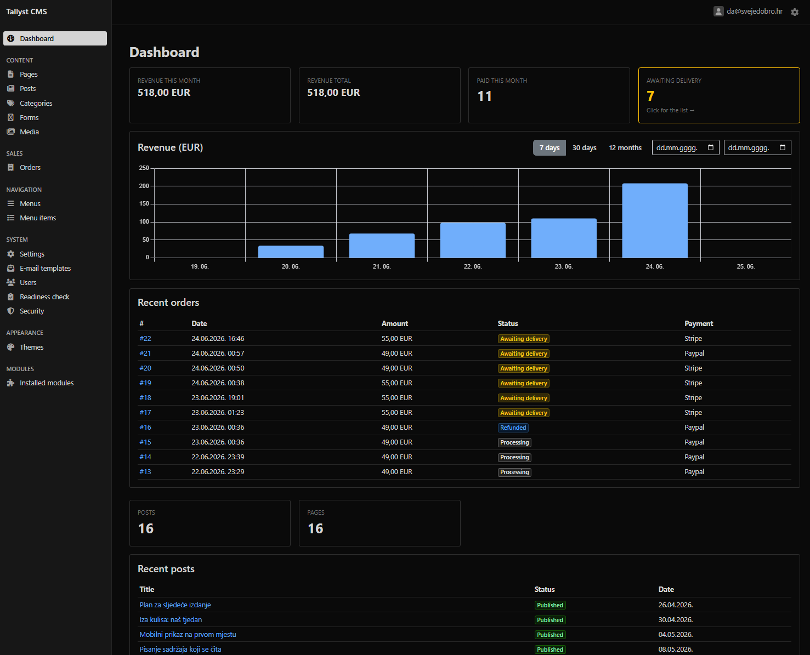
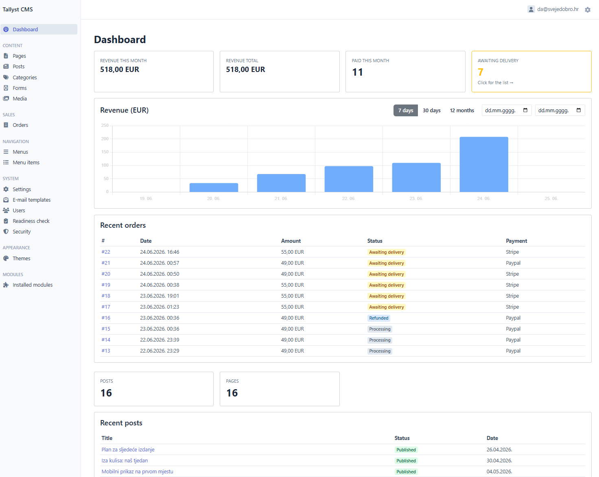

# Tallyst

**A lean, self-hosted CMS for people who sell their own thing — any page becomes a product with one shortcode. Your checkout, your data, no marketplace in between.**

[](https://packagist.org/packages/tallyst/cms)
[](LICENSE)


Built on [Symfony](https://symfony.com), installs with one command, and runs on your own server.

## Why Tallyst exists

I needed a CMS with the usual essentials — pages, posts, media — plus one thing I kept failing to find without reaching for a bloated plugin: a form builder wired directly to a payment processor. Something simple, but capable.

Most CMS and e-commerce tools are built for stores — catalogs, inventory, teams. But a lot of us aren't running a store. We're solo developers selling our own software, or small businesses with one product or a handful of services. Do we really need a full e-commerce suite to sell that?

Tallyst is my answer. You build a payment-enabled form, drop `[form id=N]` into any page, and that page becomes a product. The buyer checks out through *your* Stripe or PayPal account; the order and customer data live in *your* database. No marketplace in between, nobody taking a cut, nothing to outgrow a plan.

## Key features

- **Core CMS** — pages, posts, categories, media library, nested menus, a Tiptap content editor.
- **Form builder → payment** — the signature feature: `[form id=N]` turns any page into a product, checking out through [Stripe](https://stripe.com) or [PayPal](https://paypal.com).
- **Orders** — order lifecycle with manual fulfilment, refunds, price variants, and inclusive tax + CSV export for your accountant.
- **Themes** — auto-detected (drop a folder into `themes/`), with a child-theme parent chain.
- **Built in** — full-text search, maintenance mode, a deployment-readiness panel, and editable e-mail templates.
- **Production-grade auth** — admin/editor roles, optional TOTP two-factor, password reset, and login throttling — because it handles payments.
- **Modular by design** — core features (CMS, form builder, media) ship as self-contained bundles; the same architecture supports optional and third-party modules, so you add only what you need.

## Quick start

```bash
composer create-project tallyst/cms my-site
cd my-site
php8.5 bin/console app:install
```

1. `create-project` downloads Tallyst and silently compiles its front-end assets (via a post-create hook).
2. `app:install` is an interactive wizard — it validates your database connection, writes `.env.local`, runs migrations, and creates your admin account. Open `/admin` and log in.

> If your default `php` is older than 8.5, run Composer through the right binary:
> `php8.5 $(which composer) create-project tallyst/cms my-site`

For the full version — server setup, the background worker for e-mail/orders, webhooks, and going live — see the [detailed installation guide](docs/INSTALL.md).

## Requirements

- PHP **8.5+**
- MySQL or MariaDB
- [Composer](https://getcomposer.org)

## What Tallyst is *not*

Honest boundaries, so you can tell in 30 seconds whether it fits:

- **Not a marketplace.** It's *your* site selling *your* things — not a multi-vendor platform. This is deliberate.
- **Not a merchant of record (in v1.0).** You connect your own Stripe/PayPal and handle your own tax/VAT. MoR integrations (so a provider handles global tax for you) are planned for a future release.
- **No subscriptions or comments yet.** Planned as future modules — Tallyst v1.0 is one-time payments.
- **Not a full e-commerce suite.** By design. If you need catalogs, inventory, and a team workflow, reach for a platform built for that. Tallyst is for selling your own product or services, simply.

## Roadmap

**v1.0.0 — released.** Core CMS, form-to-payment, orders/refunds/variants/tax, themes, search, the installer, and the readiness panel.

Planned for future releases:

- Merchant-of-Record integrations (e.g. Lemon Squeezy / Paddle) for global tax compliance
- Subscriptions & recurring billing
- Automated digital delivery (download links / licence keys / access grants on fulfilment)
- A WordPress importer + portable content packs
- Optional modules (comments, …) and paid add-on modules

Tallyst follows [semantic versioning](https://semver.org) from v1.0.0 — the core API is the contract for add-on modules. See the [changelog](CHANGELOG.md) for what changed in each release.

## Screenshots

<p align="center">
  <a href="docs/images/admin-dark.png"></a>
  <a href="docs/images/admin-light.png"></a>
</p>

<p align="center"><sub>The EasyAdmin back office — dark and light themes. Click an image for the full size.</sub></p>

## Feedback

Tallyst is open source and actively developed. Bug reports and feature ideas are welcome via [GitHub issues](https://github.com/zaja/Tallyst-CMS/issues).

## License

[MIT](LICENSE) © 2026 Sve je dobro j.d.o.o.

### Third-party assets

- Icons: [Font Awesome Free](https://fontawesome.com) 6.7.2 — icons licensed under
  [CC BY 4.0](https://creativecommons.org/licenses/by/4.0/). Brand/social marks are trademarks of
  their respective owners.
- Fonts (curated in `public/fonts/`, licences in `public/fonts/LICENSES/`):
  Inter, Manrope, Space Grotesk, IBM Plex Sans, Lora, Libre Baskerville — [SIL Open Font License 1.1](https://scripts.sil.org/OFL);
  Roboto — [Apache License 2.0](https://www.apache.org/licenses/LICENSE-2.0). Reserved Font Names respected.
